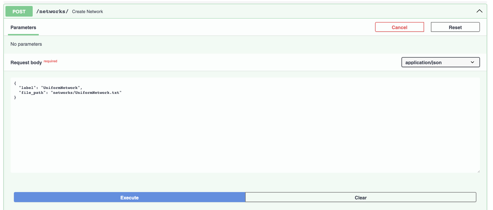
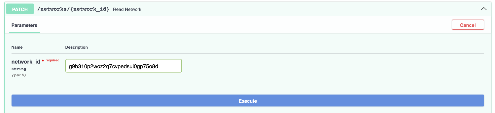
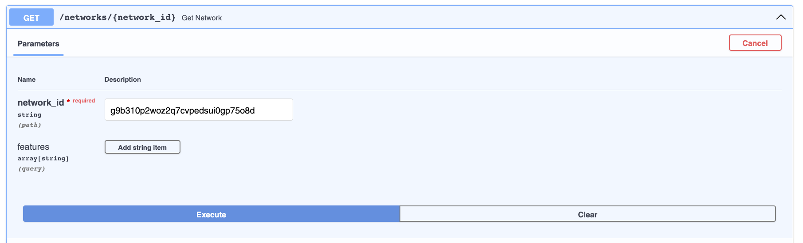
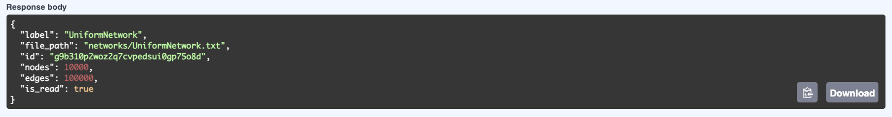
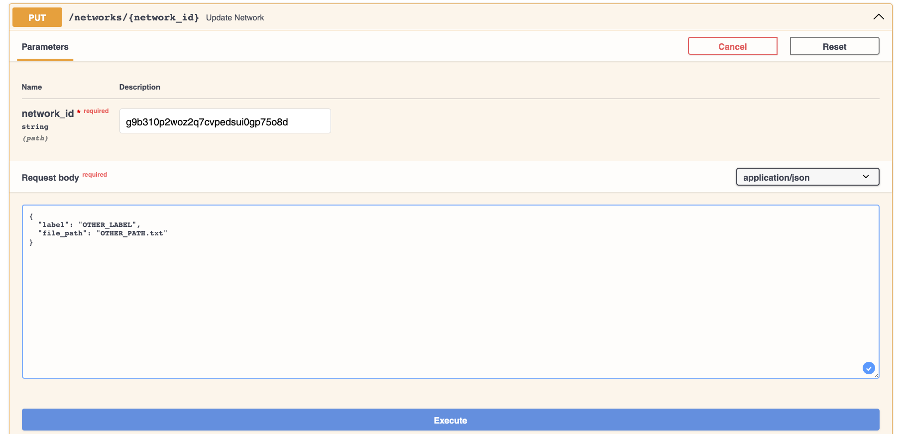

# EpiGraphX


App to simulate Epidemics on Networks.

## Introduction

In June 2023, I successfully completed my undergraduate thesis as an aspiring physicist. The aim of this project is to expand upon and refine the work I developed over the course of approximately four months.

You can find the paper I wrote about the thesis on my [LinkedIn](https://www.linkedin.com/in/arnau-perez-perez/) profile.


## How to run the app?

This project is built upon `Docker` containers to isolate all dependencies and access `Fortran` subroutines for the most computationally demanding functions thanks to [f2py](https://numpy.org/doc/stable/f2py/). You can review the [Fortran](./docs/fortran) functions I employed in my thesis.

The following command builds the app and the `PostgreSQL` database images and containers. All container configurations are specified in [DockerFile.dev](./Dockerfile.dev) and [docker-compose-dev.yml](./docker-compose-dev.yml).
```
docker compose -f docker-compose-dev.yml up --build
```
To restart the app simply run the same command omitting `--build`. You can add the `-d` parameter if you don't want to see what the container is managing in the background (`FastAPI` requests).

To interact with the app, please keep in mind that the app is running on container port **80**, which can be accessed from the local machine on port **8080**. I strongly recommend using FastAPI docs to familiarize yourself with the app once it's running (http://localhost:8080/docs).

 

## Features
### CRUD
At the moment, the app is only capable of creating, reading, updating, and deleting a network. ([crud.py](./app/crud.py) | [view.py](./app/view.py) | [main.py](./app/main.py))

## Quick start
First, note that the app stores network files in the `network` directory inside the container, sourced from the local machine, located in [docs](./docs/networks/).

---
1. Create network



---
2. Read network



---
3. Get network




---
### Delete network
Finally you can try to delete the network following the same indications as in `2. Read Network` but using `delete`.

---
### Update network
If you entered a wrong **label** or **file_path** make then use a `put` statement.



## Future implementations
- Transform table arrays into numpy arrays
- Network properties
    - `mean degree`, `mean degree square`, `shortest path`, ...   
- Spreading models
    - `SI`, `SIS`, `SIR`, `SEIR`, `SIRS`, ... 
- Optimize reading process
- Network storage
    - access **.txt** network files using `Git lfs`?

## Contributing
Before starting to develop new features, you must understand how networks are handled in this project. ([How networks are read and stored in the database?](./docs/NETWORKS.md))

Then, simply clone this repository to your local machine and begin working on [Future implementations](#Future implementations) or assist with app documentation in [README](./README.md) and [NETWORKS](./docs/NETWORKS.md).
```
git clone https://github.com/arnaupy/EpiGraphX.git
```

## Goal
Build an app to simulate and study disease spreading processes in networks, with the aim of investigating possible strategies to combat or limit the spread of diseases.

