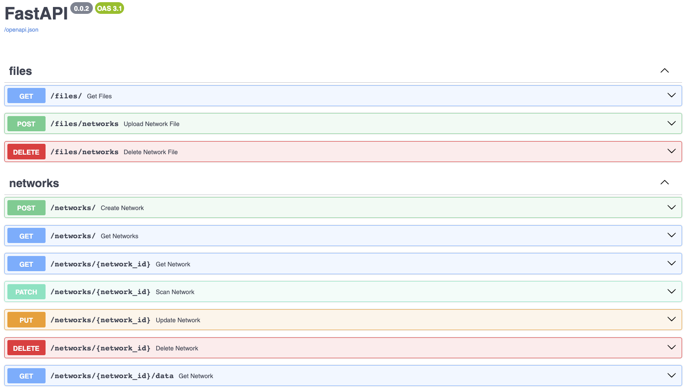

# EpiGraphX


App to simulate Epidemics on Networks.

## Introduction

In June 2023, I successfully completed my undergraduate thesis as an aspiring physicist. The aim of this project is to expand upon and refine the work I developed over the course of approximately four months.

You can find the paper I wrote about the thesis on my [LinkedIn](https://www.linkedin.com/in/arnau-perez-perez/) profile.


## How to run the app?

This project is built upon `Docker` containers to isolate all dependencies and access `Fortran` subroutines for the most computationally demanding functions thanks to [f2py](https://numpy.org/doc/stable/f2py/). You can review the [Fortran](./docs/fortran) functions I employed in my thesis.

The following command builds the `app` and the `PostgreSQL` database images and containers. All container configurations are specified in [DockerFile.dev](./Dockerfile.dev) and [docker-compose-dev.yml](./docker-compose-dev.yml).
```
docker compose -f docker-compose-dev.yml up --build
```
To restart the app simply run the same command omitting `--build`. You can add the `-d` parameter if you don't want to see what the container is managing in the background (`FastAPI` requests).

To interact with the app, please keep in mind that the app is running on container port **80**, which can be accessed from the local machine on port **8080**. I strongly recommend using FastAPI docs to familiarize yourself with the app once it's running (http://localhost:8080/docs).

 

## Features
### CRUD
At the moment, the app is only capable of creating, reading, updating, and deleting a network. ([crud.py](./app/model/crud.py) | [summary.py](./app/model/summary.py) | [file_processors.py](./app/model/file_processors.py) | [networks.py](./app/routers/networks.py))

## Quick start
To test the app, you can follow the next steps to `create` a network `scan` it and `get` its data encoded as explained in [DATABASE.md](docs/DATABASE.md).

---
### Create network
Use the `Create Network` option and send a JSON file, such as:
```
{
  "label": "EmailEnron",
  "is_private": true,
  "origin": "email-enron-large.txt"
}
```
Make sure you receive the following response with a different **id**:
```
{
  "label": "EmailEnron",
  "is_private": true,
  "origin": "email-enron-large.txt",
  "id": "jsl3b6wsqfmmq9v41bbfun88mykhuh",
  "nodes": null,
  "edges": null,
  "is_scanned": false,
  "last_update": "2023-10-03T10:47:57",
  "last_scan": null,
  "time_to_scan": null,
  "degree": null,
  "link": null,
  "pini": null,
  "pfin": null
}
```

---
### Read network
First, ensure that the network file named in 'origin' when creating the network is stored in the system. To do so, you have to upload the network file `email-enron-large.txt` you find in [networks](docs/networks) directory using the `Upload Network File` function. The response body:
```
{
  "uploaded_file": {
    "filename": "email-enron-large.txt",
    "size": 1804419
  }
}
```
Once the network is `registered` in the system and the `network file` is abailable, you can read it by adding the registered **network id** as a parameter to the `Read Network` function. The response will be:
```
{
  "scanned": true
}
```

---
### Get network
Now, attempt to retrieve the network table information using the `Get Network` operation. To get all the data from the network use this operation with the `/data` prefix (this option retrieves the four network vectors too). If you successfully execute this request, you will receive:
```
{
  "label": "EmailEnron",
  "is_private": true,
  "origin": "email-enron-large.txt",
  "id": "jsl3b6wsqfmmq9v41bbfun88mykhuh",
  "nodes": 33696,
  "edges": 180811,
  "is_scanned": true,
  "last_update": "2023-10-03T10:58:08",
  "last_scan": "2023-10-03T10:58:08",
  "time_to_scan": "1.246"
}
```

---
### Update network
If you entered an incorrect `origin` or wish to modify the `label`, use the `Update Network` functionality. Fill the following JSON file along with the network id:
```
{
  "label": "othername",
  "is_private": true,
  "origin": "otherfile.txt"
}
```
If you don't add a label, it won't be modified, but if you want to update the origin, you must specify if is_private is True or False too. Then, if everything went as expected:
```
{
  "updates": {
    "label": "EmailEnron -> othername",
    "origin": "email-enron-large.txt -> otherfile.txt"
  }
}
```
Check that the network is correctly updated by retrieving the network once again. 

---
### Delete network
Finally, you can try to delete the network using the `Delete Network` function by specifying its id. The response will be:
```
{
    "deleted": true
}
```

## Next steps and improvements
- Network properties
    - `mean degree`, `mean degree square`, `shortest path`, ...   
- Spreading models
    - `SI`, `SIS`, `SIR`, `SEIR`, `SIRS`, ... 
- Optimize reading process
- Network storage
    - access **.txt** network files using `Git lfs`?
    - using NoSQL databases?

## Contributing
Before starting to develop new features, you must understand how networks are handled in this project, see [DATABASE](./docs/DATABASE.md), and how fortran modules are handled, see [FORTRAN_MODULES](./docs/FORTRAN_MODULES.md). Make sure you have `Docker` installed ([How to install Docker?](https://docs.docker.com/engine/install/)). Read `How to run the app?` and make the short `Quick start` if you are new working with **FastAPI**. 

Then, simply clone this repository to your local machine and begin working on `Next steps and improvements` or assist with app documentation in [docs](docs) or create new in modules docstrings.
```
git clone https://github.com/arnaupy/EpiGraphX.git
```
Finally, don't forget to have fun contributing in such an ambicious project :grin:.

Feel free to make any pull request or contact me with any questions or new ideas at -> 01arnauperez@gmail.com

## Goal
Build an app to simulate and study disease spreading processes in networks, with the aim of investigating possible strategies to combat or limit the spread of diseases.

