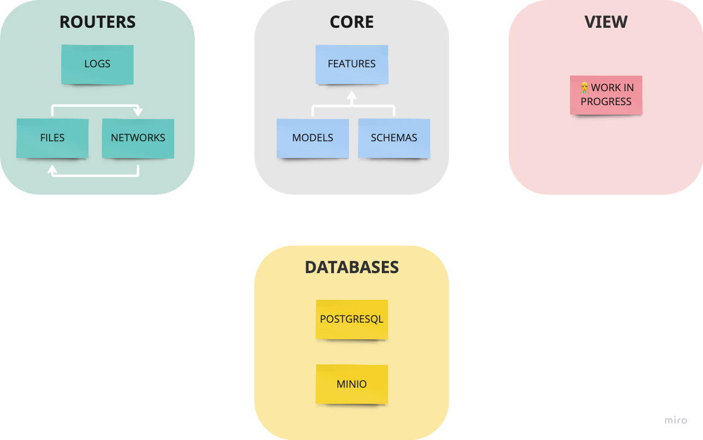

# How is code structured?
The app is structured with a specific number of layers to ensure that the code is `expandable` and `easily fixable` if necessary. For this reason, the project is divided into four different blocks that are interconnected.

## Core
This is the main piece of the code that manages the interaction between the database and backend. It consists of four interconnected parts:

- `Features` : responsible for app functionalities. 
- `Models` : represent storage objects, which can inherit from file systems or any database in `DATABASES`. 
- `Schemas` : represent `Models` sent through the API.

## Routers
This part manages the API paths. 

- `Networks` : contains all the functionalities for network objects.
- `Files` : contains any system file that can be accessed by the user.
- `Logs` : access the logs of the system by the api admin or by the developer.

## Databases
The app needs some databases to store the network data or models performance for example. Then, APIs to interact with these databeses are managed in this part of the app.

- `PostgreSQL` : SQL database for storing relational data and data that needs to be modified recurrently or accessed easily.
- `Minio` : Store data in file format. Its high-performance and S3 compatible object store makes it the apropiate choice for the app.

## View
👷 Work in progress...
