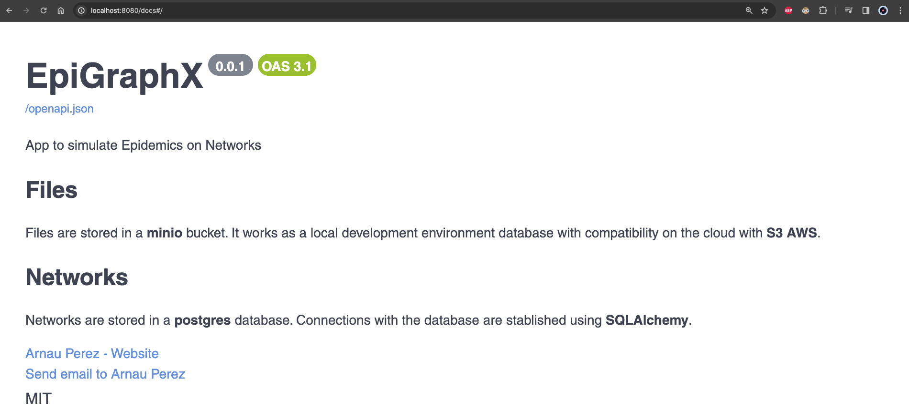
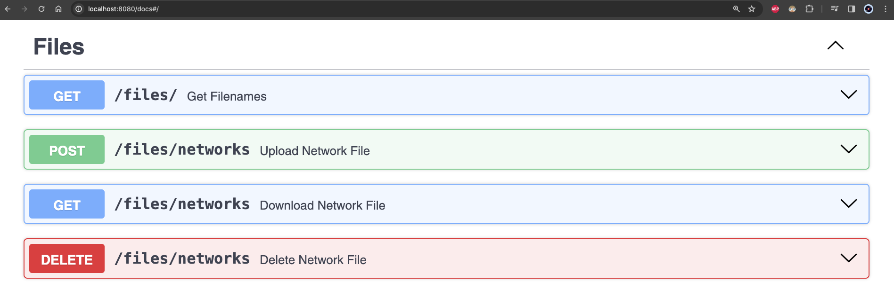
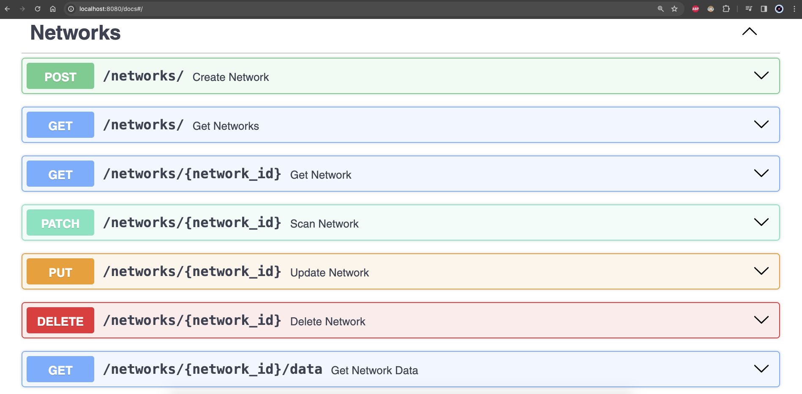

# How to interact with the backend?
This project is using `Docker` containers to isolate all app functionalities. To make it easier to interact with images and containers, you can see the [Makefile](../Makefile.md). That file is repossible to run commands using `make` followed by the comand specified in that file.

To see information about make comand, run:
```
make help
```

## Create containers
The following comand creates the corresponding images and create containers specified in [develop.yml](https://github.com/arnaupy/EpiGraphX/blob/main/develop.yml).
```
make create
``` 

## Run the server
After building containers, you can restart the server:
=== "With logs"
    ```
    make devrun
    ```
=== "Detach mode"
    ```
    make run
    ```

These comands will run the server at port `8080 `which you can access with `FastAPI docs` automatically at [http://localhost:8080/docs](http://localhost:8080/docs).
  




## Stop & Remove containers
* If you want to remove containers:
```
make down
```

* You can use the following comand to stop the containers running process.
```
make stop
```


