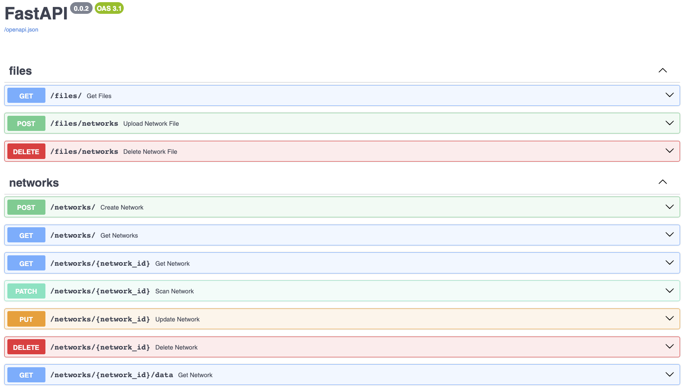

# How to interact with the backend?
This project is using `Docker` containers to isolate all app functionalities. To make it easier to interact with images and containers, you can see the [Makefile](https://github.com/arnaupy/EpiGraphX/blob/develop/Makefile). That file is repossible to run commands using `make` followed by the comand specified in that file.

To see information about make comand, run:
```
make help
```

## Create containers
The following comand creates the corresponding images and create container specified in `Docker files`.
```
make create
``` 

## Run the server
After building containers, you can restart the server:
```
# With logs
make devrun

# In detached mode
make run
```
!!! Note
    Theese comands will also run the server at port `8080 `which you can access with `FastAPI docs` automatically at [http://localhost:8080/docs](http://localhost:8080/docs)
  


## Stop & Remove containers
If you runned the server in `detached mode`, you can use the following comand to stop the processes.
```
make stop
```
Moreover, if you want to remove containers, images and volumes:
```
make down
```

